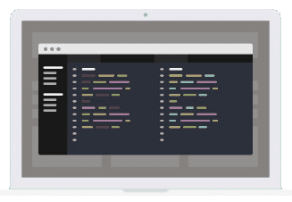

 

     
    

  
##    Desktop App

  

 

 

Central repository for Desktop Application projects.
 
  

 * Languages : Java, others.
 * Frameworks : Hibernate, others.
 * Technologies : Java SE, Java EE, others.
 * SGDB : MySQL, PostgreSQL, others.
 * Libraries / Dependencies : mysql-connector, JFreeChart, JCommon,  others.
 * Tools : Maven, Vsc, Git, Postman, Xampp, others.
   
  

 

<!------Start Index----->

## Index 📜

 
 See 

  
 
* [Java 8 SE Desktop Application for Employee Management](#java-8-se-desktop-application-for-employee-management-) [ Java Swing, Mysql, others ]

 

<!------Stop Index----->
  
  
 
  
 
 <!------Start Java 8 App Employee Management------>

 ### Java 8 SE Desktop Application for Employee Management. [🔝](#index-)

### [[Repository]](https://github.com/andresWeitzel/Gestor_de_Empleados)

 
 
  
 

   
###  Technology Stack Used
  
 

  
  
  
  
  
  
  

   <!------ End Java 8 App Employee Management------>

 
 
 
 
 
 
 
 
 

  
 ### Aplicación de Escritorio Java 8 SE para el Control de Fármacos en Chimpancés.

  
  
 ###  Repositorio
  
 
 
   

  
 

  
 ### Tecnologías Empleadas 
  

 

 

  
  
  
  
  
  
 

 

  
  
  
   

   
  
  
 
 
 

  
### Aplicación de Escritorio Java 8 SE para la Gestión de Gastos Personales.

  

 ###  Repositorio
  
 
 
   

  
 

  
  
 ###  Tecnologías Empleadas 

  
 

  
  
  
  
  
  
  
 
  

 

