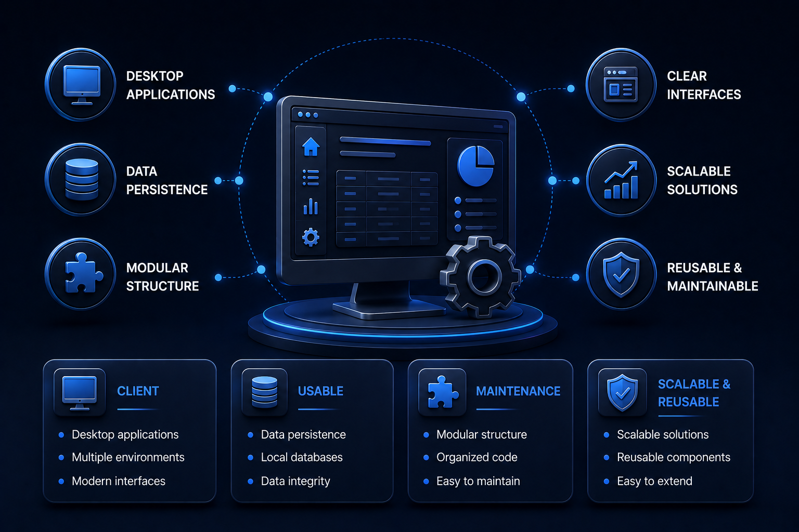
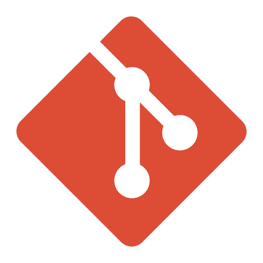
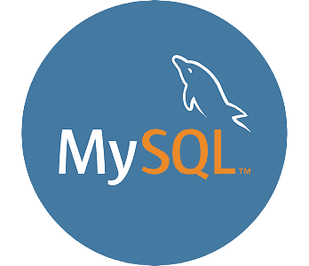
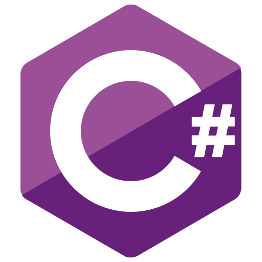

 

    
    

  
##    Aplicaciones de Escritorio

 

Repositorio central para aplicaciones de escritorio que digitalizan la operación interna de organizaciones: administración de registros y usuarios, cobros y control operativo, reportes analíticos, interfaces gráficas con Swing y Windows Forms, persistencia relacional y no relacional, y despliegue local y productivo.
 
 

  * Lenguajes: Java, C#, otros.
  * Frameworks: Swing, Windows Forms, JavaFX, JDBC, otros.
  * Tecnologías: Java SE, .NET, Maven, otros.
  * Bases de datos: MySQL, MariaDB, PostgreSQL, otros.
  * Librerías: mysql-connector, JFreeChart, JCommon, ADO.NET, otros.
  * Herramientas: NetBeans, VSC, Git, Postman, XAMPP, DBeaver, Docker, otros.
  * Patrones: DAO, Singleton, otros.
   
 
 

<!------Start Index----->

## Índice 📜

 
 Ver 

  

#### 🗂️ Proyectos

* [Plataforma de Gestión Fitness ](#fitness-manager-platform)

  
     

* [Gestión de Club Deportivo ](#sports-club-management)

  
     

* [Gestión y Reportes de Empleados ](#employee-management-and-reporting)

  
     

* [Control de Fármacos en Chimpancés ](#drug-control-for-chimpanzees)

  
     

* [Gestión de Gastos Personales ](#personal-expense-management)

  
     

 

<!------Stop Index----->
  
 
 

    
 ## 🗂️ Proyectos

 

 <!------START fitness-manager-platform------>

  

### Plataforma de Gestión Fitness 

  
     

 

 ### Detalles

   
<!------END fitness-manager-platform------->

 
 
  
 

 <!------START sports-club-management------>

  

### Gestión de Club Deportivo 

  
     

 

 ### Detalles

   
<!------END sports-club-management------->

 
 
  
 

 <!------START employee-management-and-reporting------>

  

### Gestión y Reportes de Empleados 

  
     

 

 ### Detalles

   
<!------END employee-management-and-reporting------->

 
 
  
 

 <!------START drug-control-for-chimpanzees------>

  

### Control de Fármacos en Chimpancés 

  
     

 

 ### Detalles

   
<!------END drug-control-for-chimpanzees------->

 
 
  
 

 <!------START personal-expense-management------>

  

### Gestión de Gastos Personales 

  
     

 

 ### Detalles

   
<!------END personal-expense-management------->

 
 
  
 
