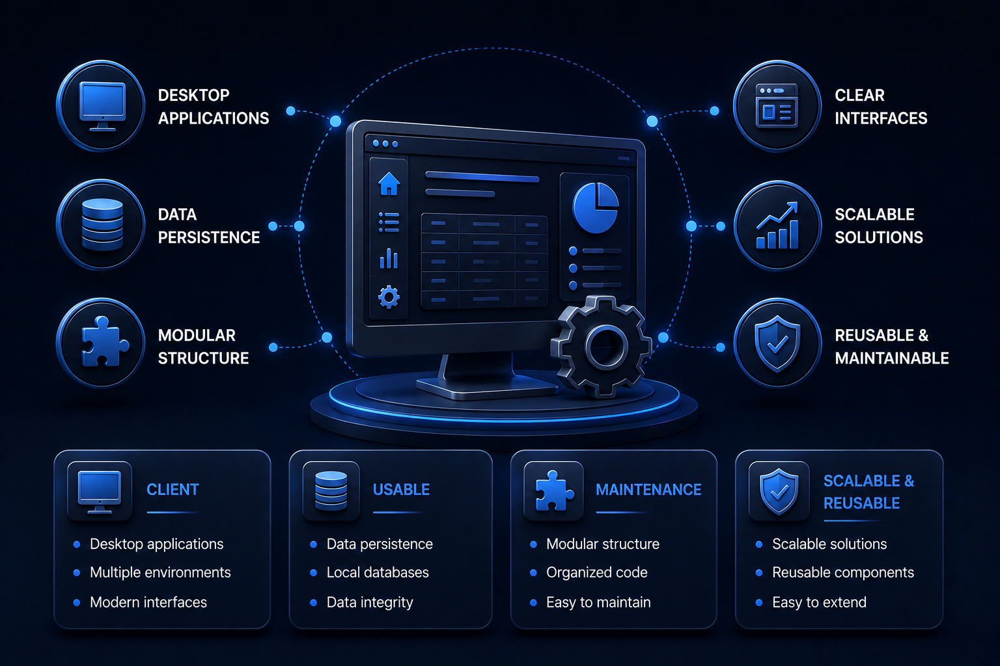
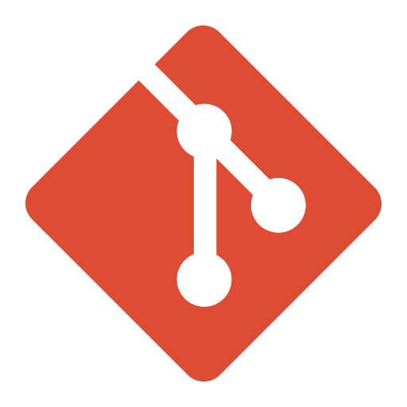
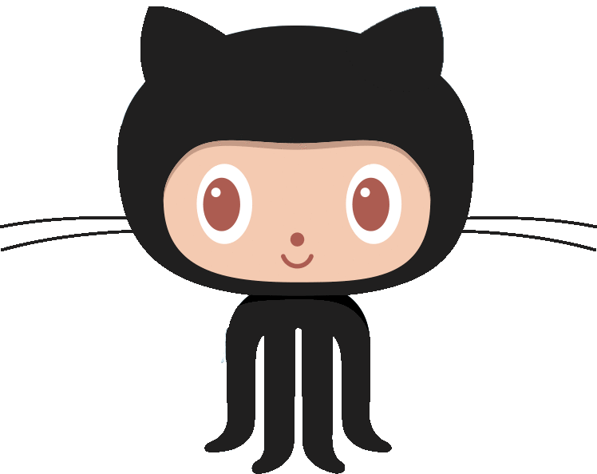

 

    
   

  
##    Aplicaciones de Escritorio

 

Este repositorio reúne proyectos de aplicaciones de escritorio construidos con distintos enfoques y tecnologías, mostrando soluciones con interfaces claras, persistencia de datos y una estructura modular pensada para mantenimiento, escalabilidad y reutilización.
 
 

 * Lenguajes : Java, otros.
 * Frameworks : Hibernate, otros.
 * Tecnologías : Java SE, Java EE, otras.
 * SGDB : MySQL, PostgreSQL, otros.
 * Librerías / Dependencias : mysql-connector, JFreeChart, JCommon, otras.
 * Herramientas : Maven, VSC, Git, Postman, Xampp, otras.
   
 
 

<!------Start Index----->

## Índice 📜

 
 Ver 

  

#### 🗂️ Proyectos

* [Gestión y Reportes de Empleados ](#employee-management-and-reporting)

  

    
    
    
    
    
  

* [Control de Fármacos en Chimpancés ](#drug-control-for-chimpanzees)

  

    
    
    
    
    
  

* [Gestión de Gastos Personales ](#personal-expense-management)

  

    
    
    
    
    
  

 

<!------Stop Index----->
  
 
 

    
 ## 🗂️ Proyectos

 

 <!------START employee-management------>

  

### Gestión y Reportes de Empleados  [🔝](#index)

  

    
    
    
    
    
  

 

 ### Detalles

  

   
<!------END employee-management------->

 
 
  
 

 <!------START drug-control------>

  

### Control de Fármacos en Chimpancés  [🔝](#index)

  

    
    
    
    
    
  

 

 ### Detalles

  

   
<!------END drug-control------->

 
 
  
 

 <!------START expense-management------>

  

### Gestión de Gastos Personales  [🔝](#index)

  

    
    
    
    
    
  

 

 ### Detalles

  

   
<!------END expense-management------->

